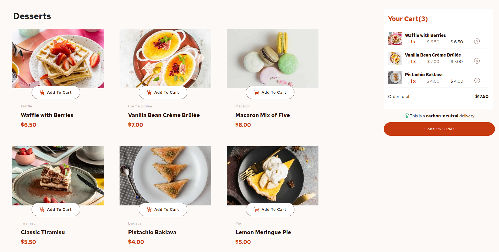
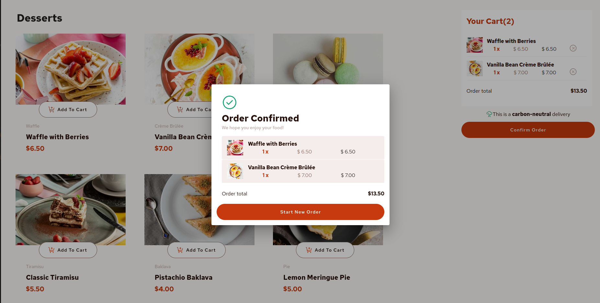
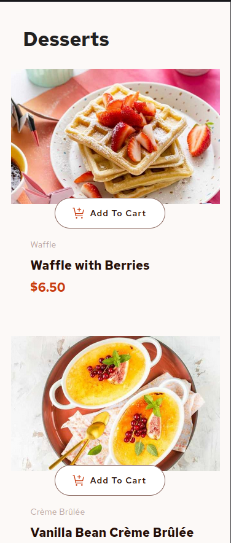

# Frontend Mentor - Product list with cart

### Welcome! 👋
This is a solution of  [Front-End Mentor Code Challenge](https://www.frontendmentor.io/challenges/product-list-with-cart-5MmqLVAp_d).

### The challenge

Users should be able to:

- Add items to the cart and remove them
- Increase/decrease the number of items in the cart
- See an order confirmation modal when they click "Confirm Order"
- Reset their selections when they click "Start New Order"
- View the optimal layout for the interface depending on their device's screen size
- See hover and focus states for all interactive elements on the page

### Screenshots

### Built with
- [Vue.js](https://vuejs.org/) - JS library
- [Pinia](https://pinia.vuejs.org/) - Store library for Vue.js
- [Vuetify](https://vuetifyjs.com/en/) - UI library for Vue.js

### Links
https://astonishing-kashata-f11bbd.netlify.app/
## Author
- Frontend Mentor - [@CarolineT9](https://www.frontendmentor.io/profile/CarolineT9)